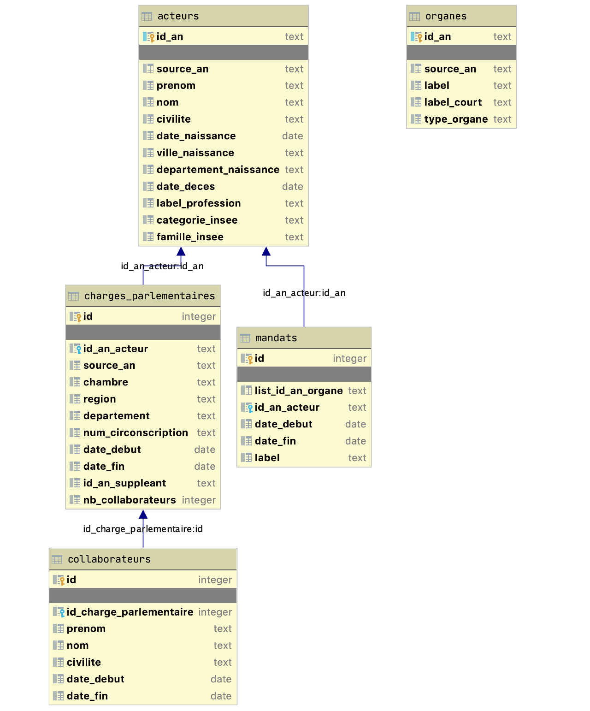

# Parlementaires lite

Les données se requêtent plus aisément dans une base de données que
 dans un ensemble de fichiers au formats éparses. Ce projet permet la transformation des 
 données mises à disposition par l'assemblée nationale Française au format JSON 
 en une base SQLite prête à l'emploi -- sous réserve de conservation du schéma de 
 données utilisé en 2020. Le périmètre couvert pour cette première version est celui de 
 l'historique des parlementaires et les organes auxquels ils ont pu participer.

## Récupérer la dernière base de données

Vous pouvez y accéder soit directement sur ce dépôt avec le fichier `parlementaires.lite`. Ou en accédant à une 
copie disponible sur le serveur ftp de l'écho gaulois et sur dat.

## Les requêtes qui interrogent sur la transparence du débat public

Nombre de collaborateurs associés à une charge parlementaire ayant débuté avant 2017 :

```sql
select count(*)
from collaborateurs
inner join charges_parlementaires cp on collaborateurs.id_charge_parlementaire = cp.id
where cp.date_debut < date('2017-01-01')

/* => cette requête renvoie 0 */
```

Nombre de collaborateurs associés à une charge parlementaire ayant débuté après 2017 :

```sql
select count(*)
from collaborateurs
inner join charges_parlementaires cp on collaborateurs.id_charge_parlementaire = cp.id
where cp.date_debut > date('2017-01-01');

/* => cette requête renvoie 2135 */
```

## Le schéma de données

Le passage à SQLite n'a pas  modifié les notions 
employées dans les exports de l'Assemblée Nationale. Un acteur (est une personne
physique) participe à un ou plusieurs organes pour une période. Un organe parlementaire
peut être : un siège de député ou de sénateur, la participation à un groupe de travail, etc.
 
 Chaque type d'organe a des caractéristiques spécifiques. Nous avons extrait les organes
 correspondant à un siège de député et de sénateur dans une table nommée charge parlementaire.
 Elle permet de requêter plus facilement les spécificités de ce type d'organe.
 
Chacun des enregistrements contient la source JSON associée.



## Quelques exemples de requêtes :

Liste des charges parlementaires : de leur suppléant, des échéances et du nombre de collaborateurs référencés :

```sql
select cp.chambre, a.prenom, a.nom, s.prenom, s.nom, cp.date_debut, cp.date_fin, cp.nb_collaborateurs
from charges_parlementaires cp
inner join acteurs a on cp.id_an_acteur = a.id_an
left outer join acteurs s on cp.id_an_suppleant = s.id_an
```

Nombre de charges parlementaires référencées :

```sql
select count(*) from charges_parlementaires;
```

Nombre de charges parlementaires ayant des collaborateurs référencés :`

```sql
select count(*) 
from charges_parlementaires 
where nb_collaborateurs > 0;
```

Nombre de charges parlementaires datant d'avant 2017 ayant des collaborateurs référencés :

```sql
select count(*) 
from charges_parlementaires 
where nb_collaborateurs > 0 and date_debut < date('2017-01-01');
```

Répartition des familles insee associées aux charges parlementaires de député :

```sql
select count(*) as nb, a.famille_insee
from charges_parlementaires cp
inner join acteurs a on cp.id_an_acteur = a.id_an
where cp.chambre like 'Assemblée%' 
group by a.famille_insee
order by nb desc
```

Répartition des catégories insee associées aux charges parlementaires de député :

```sql
select count(*) as nb, a.categorie_insee
from charges_parlementaires cp
inner join acteurs a on cp.id_an_acteur = a.id_an
where cp.chambre like 'Assemblée%' 
group by a.categorie_insee
order by nb desc
```

Répartition des professions depuis la 15ème législature :

```sql
select count(*) as nb, a.label_profession
from charges_parlementaires cp
inner join acteurs a on cp.id_an_acteur = a.id_an
where cp.chambre like 'Assemblée%' and cp.date_debut > date('2017-06-01')
group by a.label_profession
order by nb desc
```

Répartition des professions de la 14ème législature :

```sql
select count(*) as nb, a.label_profession
from charges_parlementaires cp
inner join acteurs a on cp.id_an_acteur = a.id_an
where cp.chambre like 'Assemblée%' 
and cp.date_fin < date('2017-07-01') 
and cp.date_debut > date('2012-06-01')
group by a.label_profession
order by nb desc
```

Lister les collaborateurs associés à un parlementaire :

```sql
select *
from collaborateurs
inner join charges_parlementaires cp on collaborateurs.id_charge_parlementaire = cp.id
inner join acteurs a on cp.id_an_acteur = a.id_an
where a.nom like '' and a.prenom like ''
```


Charges parlementaires où le député est né ans le département associé (si le département est référencé) :

```sql
select a.prenom, a.nom, cp.departement, cp.chambre, cp.date_debut, cp.date_fin
from charges_parlementaires cp
inner join acteurs a on cp.id_an_acteur = a.id_an
where departement is not null
and departement = a.departement_naissance
```

Qui sont les parlementaires ayant participé à un organe parlementaire portant sur l'évolution et le rôle de l'OTAN :

```sql
select a.id_an, a.prenom, a.nom, m.date_debut, m.date_fin, m.label, o.label
from acteurs a
inner join mandats m on a.id_an = m.id_an_acteur
inner join organes o on m.list_id_an_organe = o.id_an
where o.label like "Évolution et rôle de l'OTAN";
```


*NB :* Rester critique sur les résultats obtenus. Le meilleur
moyen de s'assurer d'une trouvaille : la faire confirmer par quelqu'un. Une 
erreur de compréhension des données ou dans la formulation d'une requête est vite arrivée.
Il faut toujours documenter la méthodologie employée avant de présenter un résultat.

## Constituer soi-même la base de données

Le projet nécessite :

- Python 3.7.
- poetry (https://python-poetry.org)
- SQLite

Poetry installé, il suffit de se rendre dans le terminal
à la racine du projet cloné et exécuter :

```bash
poetry run liteitup
```

La base de données `parlementaires.lite` est reconstruite
à chaque exécution de cette commande à la racine de ce projet.

## Contributions

Nous encourageons la libre réappropriation de ce projet.
 
## Développements possibles 
 
### Techniques
 
 * Retranscrire plus de propriétés dans la base SQL
 * Intégrer le téléchargement des sources
 * Réaliser un export référençant les données manquantes 
 * Intégrer des sources de données complémentaires pour enrichir le modèle
 * Intégrer la base de données à un notebook Jupyter prêt à l'emploi
 
### Technico-politique
 
 * Retranscrire la philosophie du présent projet dans d'autres domaines
 
### Politiques
 
 * Demander les comptes concernant la mise en place des plateformes Open Data à nos administrations : 
 un serveur ftp hébergeant des exports SQL est moins coûteux et plus utile
 

